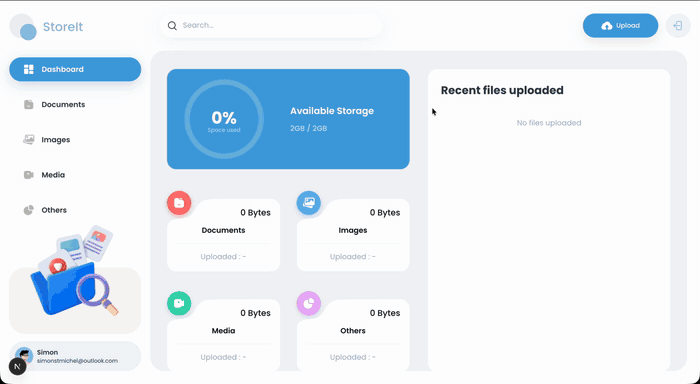
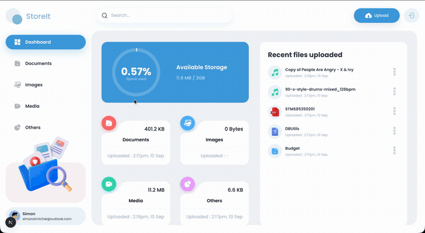
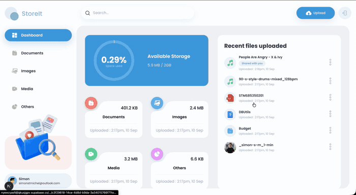
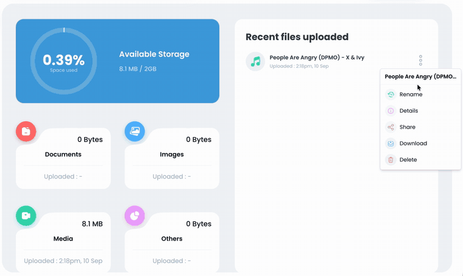
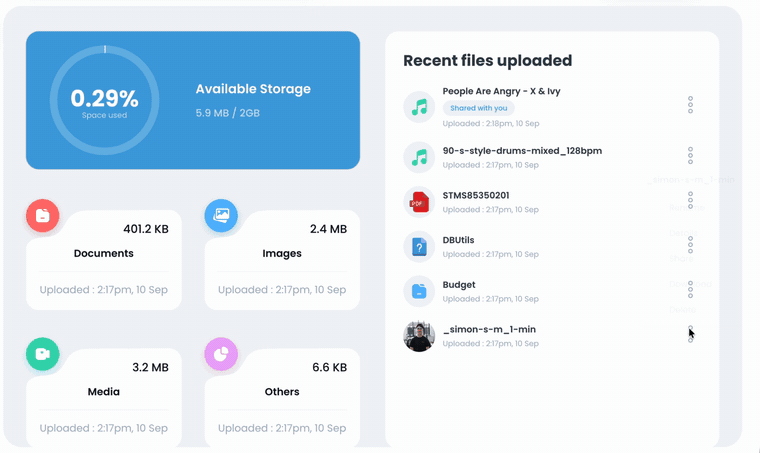
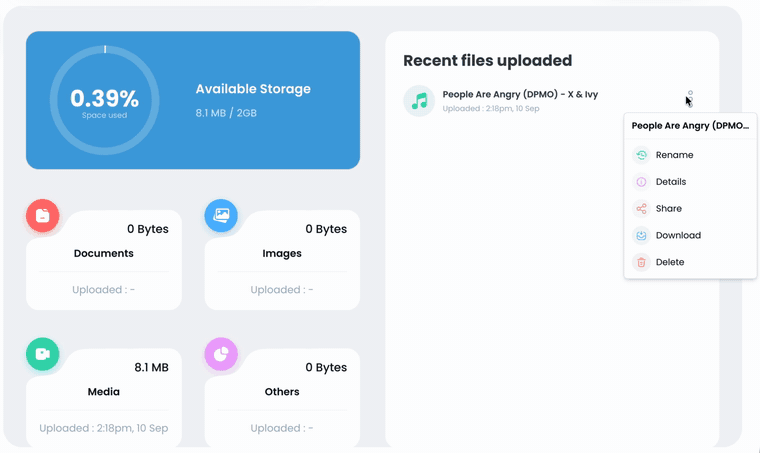
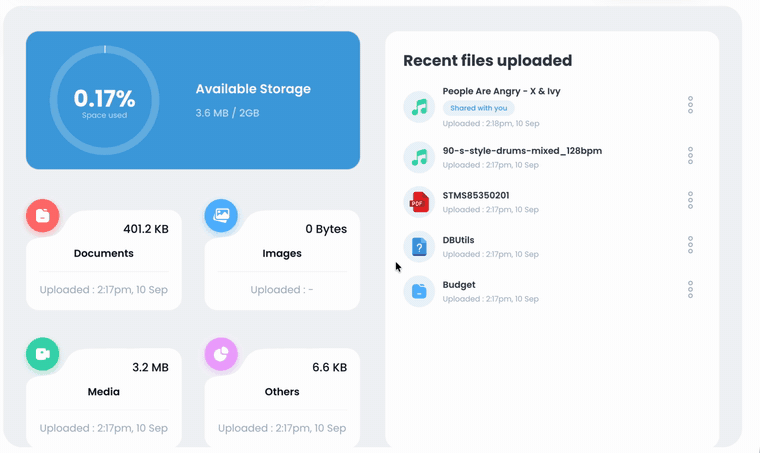
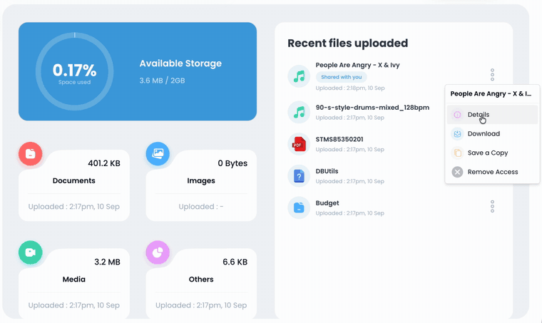
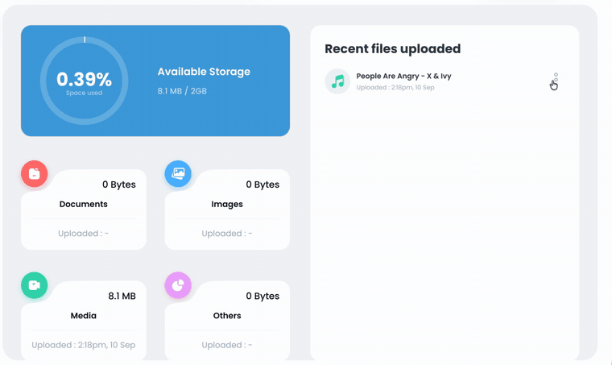
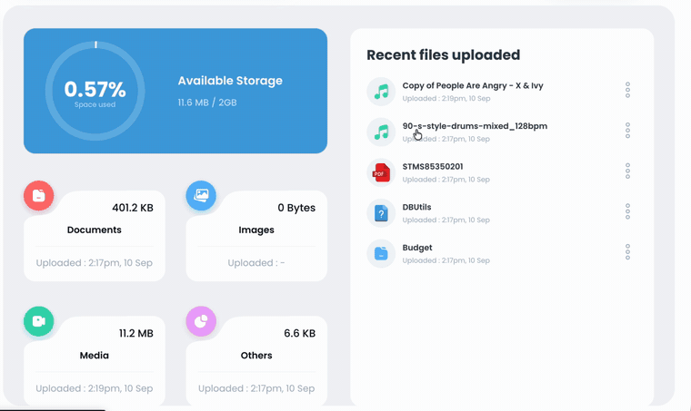

# Démo

[English](./DEMO.md) | **Français**

Toutes les fonctionnalités de StoreIt, enregistrées du début à la fin en une seule session sur le
projet Supabase en production. Deux vrais comptes apparaissent tout au long de la démo :

- **Propriétaire** `simonstmichel23@gmail.com`, connecté avec Google
- **Destinataire** `simonstmichel@outlook.com`, connecté par courriel et mot de passe

## Démonstration complète

Un montage de 2:27 qui présente les seize fonctionnalités dans l'ordre, chacune identifiée à
l'écran au moment où elle apparaît.

**[docs/demo/storeit-demo.mp4](docs/demo/storeit-demo.mp4)**

Les extraits ci-dessous proviennent du même enregistrement, découpé par fonctionnalité.

---

## Authentification

### Connexion par courriel et avec Google

Supabase Auth gère les deux fournisseurs. L'inscription par courriel envoie un lien de confirmation
avant que le compte soit utilisable, et Google OAuth fait l'aller-retour par `app/auth/callback`
pour échanger le code contre une session. L'extrait ci-dessus suit le parcours Google, de la
déconnexion jusqu'à l'arrivée dans un deuxième compte, vide. Le parcours par courriel, y compris le
message de confirmation, se trouve dans la démonstration complète.

---

## Travailler avec les fichiers

### Téléversement

Par glisser-déposer ou avec le sélecteur de fichiers, plusieurs fichiers à la fois, chacun avec sa
propre barre de progression. Le type de fichier est détecté à partir de l'extension et le graphique
de stockage se met à jour sans recharger la page. Les fichiers jusqu'à 50 Mo sont acceptés.

### Parcourir par type

Documents, images, médias et autres sont des routes distinctes qui reposent sur un seul segment
dynamique. Chaque page affiche son propre total et un contrôle de tri par nom, taille et date.

### Recherche

La recherche globale filtre au fur et à mesure de la saisie, avec un délai anti-rebond, et mène
directement à la page du type correspondant au fichier trouvé.

### Aperçu

Cliquer sur un fichier l'ouvre directement dans le navigateur. Le bucket est privé : le navigateur
reçoit donc une URL signée, générée côté serveur au moment de la lecture et valide une heure. Il
n'y a aucune URL de fichier publique permanente nulle part dans l'application.

### Détails du fichier

Format, taille, dernière modification et liste des comptes avec qui le fichier est actuellement
partagé. C'est la façon la plus rapide de confirmer qu'un partage a bien fonctionné.

### Renommer

Réservé au propriétaire. La vérification du propriétaire est intégrée à la requête de mise à jour
elle-même : une requête venant de quelqu'un d'autre ne correspond à aucune ligne, au lieu d'être
simplement filtrée dans l'interface.

### Supprimer

Retire à la fois la ligne de la base de données et l'objet stocké, et le total de l'espace utilisé
diminue en conséquence.

---

## Partage et contrôle d'accès

### Partager un fichier

Le propriétaire partage par adresse courriel. Les adresses sont mises en minuscules et dédoublonnées
sur le serveur, de sorte qu'une adresse qui mélange majuscules et minuscules correspond quand même
à la lecture, et le partage d'un fichier avec soi-même est refusé.

### Partagé avec vous

Maintenant, du côté du destinataire. Le fichier apparaît dans son tableau de bord avec un badge
**Shared with you**, et son menu montre ce qu'un non-propriétaire a le droit de faire : Details,
Download, Save a Copy, Remove Access. Rename, Share et Delete n'y sont tout simplement pas.

Comparez avec le menu du propriétaire dans les extraits de renommage et de détails plus haut, qui
contient les cinq options. Dans le tutoriel d'où ce projet est parti, un destinataire obtenait le
menu complet et pouvait renommer, supprimer ou repartager un fichier qui ne lui appartenait pas. La
restriction est appliquée dans la Server Action, pas seulement dans la liste affichée.

### Enregistrer une copie

Choisir **Save a Copy** dans ce même menu duplique le fichier de stockage à stockage. La copie
apparaît dans la liste du destinataire sans badge, puisqu'elle lui appartient maintenant
entièrement, et l'espace utilisé passe de 0,17 % à 0,57 %, car la copie compte dans son quota
plutôt que dans celui du propriétaire.

### Révoquer l'accès

Retour dans le compte du propriétaire. Son menu a toujours les cinq options. Ouvrir **Share**
montre que le fichier est partagé avec un utilisateur, et cliquer sur le bouton de retrait à côté
de l'adresse le retire immédiatement, sans étape d'enregistrement distincte. Rouvrir la fenêtre
confirme qu'elle indique maintenant un partage avec zéro utilisateur.

### La révocation prend effet

De retour dans le compte du destinataire, le fichier partagé a disparu, alors que la copie qu'il a
enregistrée est intacte et offre le menu complet du propriétaire. C'est tout le modèle de propriété
en un seul écran.