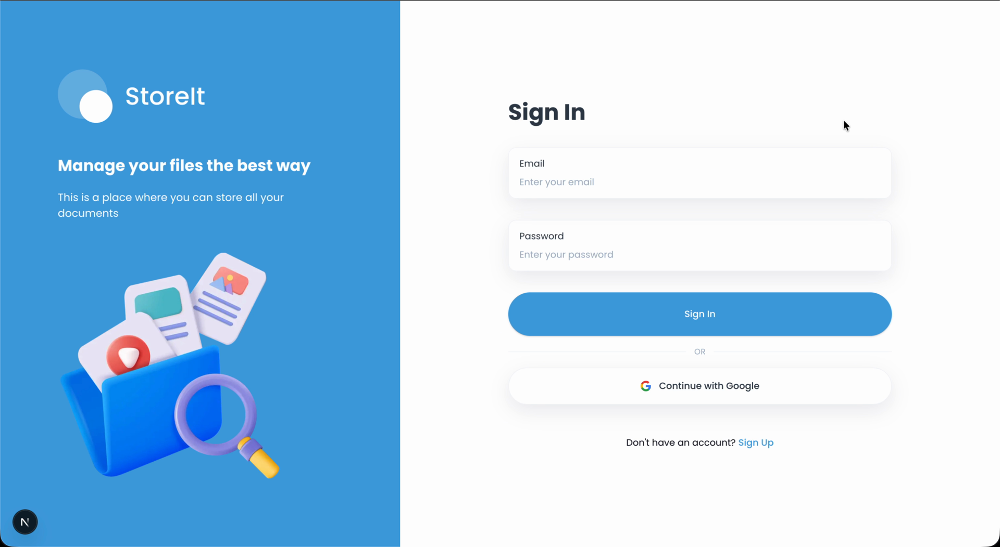
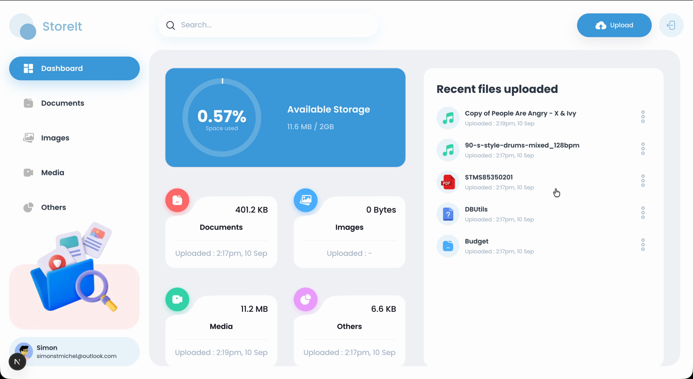
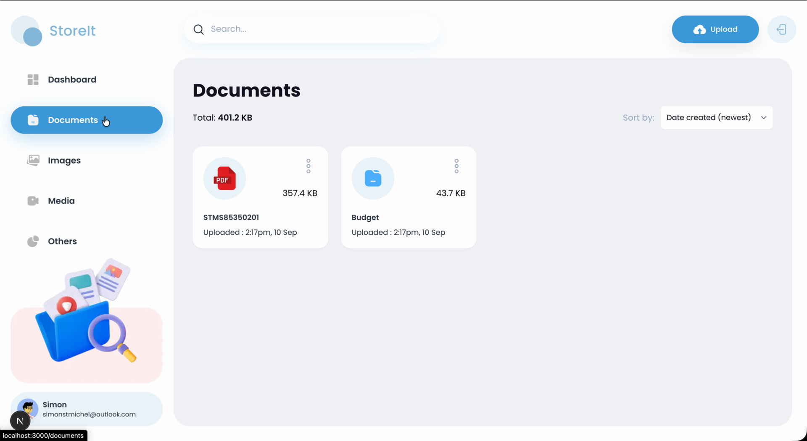
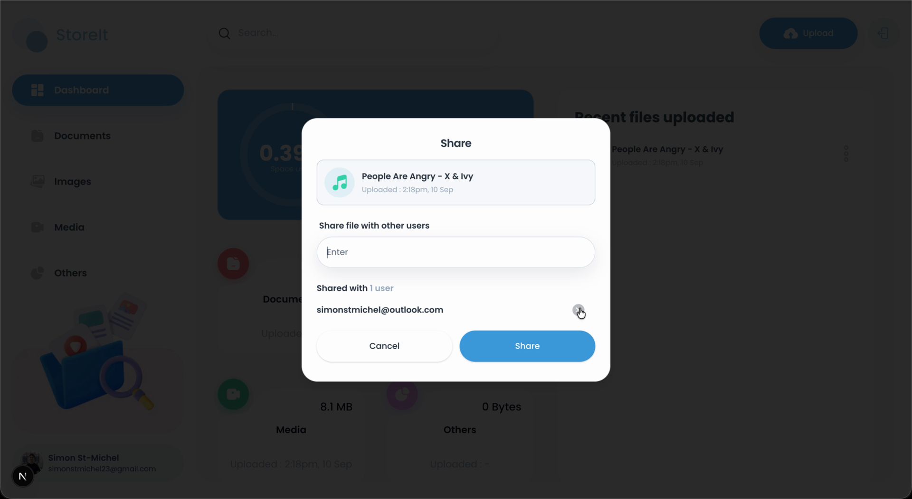

# Google Drive Clone

**English** | [Français](./README.fr.md)

A Google Drive-style file storage app: upload, preview, download, rename, share, and delete files, with a usage dashboard, global search, and sorting.

<div align="center">
  <div>
    
    
    
    
  </div>
</div>

> Originally built on Appwrite and migrated to Supabase. All backend access (auth, database, storage) now goes through Supabase.

## 📋 Table of Contents

1. [Demo](#demo)
2. [Project History](#project-history)
3. [Tech Stack](#tech-stack)
4. [Features](#features)
5. [Getting Started](#getting-started)
6. [Architecture](#architecture)
7. [Known Limitations & Next Steps](#limitations)

## <a name="demo">🎬 Demo</a>

**Full walkthrough (2:42):** [`docs/demo/storeit-demo.mp4`](docs/demo/storeit-demo.mp4)

[`DEMO.md`](./DEMO.md) breaks the same recording into one clip per feature.

### Demo snippets

| | |
|---|---|
|  |  |
| **Share by email.** Addresses are lowercased and de-duplicated server-side, and sharing with yourself is rejected. | **Shared with you.** The recipient gets a badge, a signed URL, and a shorter action menu with no Rename, Share or Delete. |
|  |  |
| **Save a copy.** A storage-to-storage duplicate the recipient owns outright, counted against their quota. | **Revoke.** The owner drops the recipient and the shared file disappears, while the saved copy stays. |

### Screens

| | |
|---|---|
|  |  |
| Sign-in - email/password + Google OAuth | Dashboard - storage chart and per-type usage |
|  |  |
| A type listing with sorting and per-file actions | Sharing a file by email |

## <a name="project-history">📖 Project History</a>

This is a portfolio project, built to practice a real backend migration
and to have something concrete to demo. It went through three phases:

**1. The tutorial.** Started from JavaScript Mastery's "Store It" Google Drive clone tutorial,
built on Next.js + Appwrite (auth, database, storage). Followed it through the core feature
set: email/password auth, drag-and-drop upload, file listing by type, rename, share-by-email,
delete, and a storage-usage dashboard.

**2. The Supabase migration.** Once the tutorial was finished, the entire backend was swapped
from Appwrite to Supabase as a self-directed refactor - not part of the tutorial. This meant:
- Rebuilding auth (email/password + Google OAuth) on Supabase Auth, including session refresh
  via Next.js 16 middleware (`proxy.ts`)
- Replacing Appwrite's document DB with a Postgres `files` table, plus Row Level Security
  policies as defense-in-depth behind the service-role server actions
- Replacing Appwrite storage with a private Supabase bucket served entirely through
  short-lived signed URLs (never a public file URL)
- Re-deriving every Server Action (`lib/actions/file.actions.ts`) against the new schema, and
  upgrading the app from Next.js 15 to 16 along the way

**3. Going beyond the tutorial.** With the migration done, the sharing model got a real security
and UX pass that the original tutorial never had:
- Found and closed a gap where any user a file was shared with could rename, delete, or
  re-share someone else's file - these are now locked to the file's owner, enforced
  server-side (not just hidden in the UI)
- Added a visual "Shared with you" indicator so shared files are visually distinct from your
  own
- Added **Save a Copy**, so a recipient can duplicate a shared file into their own account -
  it survives the owner deleting the original or revoking access
- Added **Remove Access**, so a recipient can drop themselves from a share without needing the
  owner to do it
- Blocked sharing a file with your own email (a harmless but pointless no-op in the original
  tutorial code)
- Redesigned the sign-in screen's Google button and status messages, which had been styled
  for a dark UI and rendered wrong on this app's light theme

## <a name="tech-stack">⚙️ Tech Stack</a>

| Layer | Technology |
|---|---|
| Framework | Next.js 16 (App Router, Server Actions) |
| Language | TypeScript |
| Auth & DB & Storage | Supabase |
| Styling | Tailwind CSS + shadcn/ui |
| Runtime | React 19 |

## <a name="features">🔋 Features</a>

- **Authentication** - email/password and Google OAuth (Supabase Auth)
- **File upload** - drag & drop or picker; 50 MB max; type auto-detected (document / image / video / audio / other)
- **Preview** - open a file inline in a new tab via a short-lived signed URL
- **Download** - authorized download route (owner or shared users only)
- **Rename / Delete** - owner-only, enforced server-side
- **Sharing** - share a file with other users by email; shared files appear in their account,
  visually marked "Shared with you", with a restricted action menu (no rename/delete/reshare)
- **Save a Copy** - a recipient can duplicate a shared file into their own account, independent
  of the original
- **Remove Access** - a recipient can drop themselves from a share at any time
- **Dashboard** - storage-usage chart and per-type summaries
- **Global search** and **sorting** (name, size, date)
- **Responsive** layout with a mobile navigation drawer

## <a name="getting-started">🤸 Getting Started</a>

### 1. Install dependencies

```bash
npm install
```

### 2. Create a Supabase project

Create a project at [supabase.com](https://supabase.com), then complete the steps below.

#### a. Database - create the `files` table

In the Supabase **SQL Editor**, run:

```sql
create table public.files (
  id             uuid primary key default gen_random_uuid(),
  name           text not null,
  type           text not null check (type in ('document','image','video','audio','other')),
  extension      text default '',
  size           bigint default 0,
  bucket_file_id text unique not null,
  owner          uuid not null references auth.users(id) on delete cascade,
  account_id     uuid,
  shared_with    text[] not null default '{}',   -- emails the file is shared with
  created_at     timestamptz not null default now(),
  updated_at     timestamptz not null default now()
);

create index files_owner_idx  on public.files(owner);
create index files_shared_idx on public.files using gin(shared_with);

-- keep updated_at current. `set search_path = ''` stops the function resolving
-- unqualified names through the caller's search_path (Supabase's database linter
-- flags a mutable search_path on SECURITY-sensitive functions).
create or replace function public.set_updated_at() returns trigger
  language plpgsql
  set search_path = ''
  as $$ begin new.updated_at = now(); return new; end $$;
create trigger files_touch before update on public.files
  for each row execute function public.set_updated_at();

-- Row Level Security (defense-in-depth; server actions use the service-role key
-- and bypass RLS, but these protect any direct client access).
alter table public.files enable row level security;

create policy "files_read" on public.files for select to authenticated
  using (owner = auth.uid() or (auth.jwt()->>'email') = any(shared_with));
create policy "files_insert" on public.files for insert to authenticated
  with check (owner = auth.uid());
create policy "files_update" on public.files for update to authenticated
  using (owner = auth.uid());
create policy "files_delete" on public.files for delete to authenticated
  using (owner = auth.uid());
```

#### b. Storage - create a private bucket

- **Storage → New bucket** → name it **`files`**, keep it **Private** (public access off).
- No storage policies are required: all uploads/downloads happen server-side with the
  service-role key, and files are served to the browser through **short-lived signed URLs**.

#### c. Auth - providers & redirect URLs

- **Authentication → Providers → Email**: enabled. For the smoothest local testing you can
  turn **"Confirm email"** off (sign-up logs in immediately). If you leave it on, users must
  click the confirmation link, which is handled by `app/auth/confirm/route.ts`.
- **Authentication → Providers → Google**: enable and add your Google OAuth client ID/secret.
- **Authentication → URL Configuration**:
  - Site URL: `http://localhost:3000`
  - Redirect URLs: add `http://localhost:3000/auth/callback`
- **Authentication → Policies**: turn on **leaked password protection** (checks new passwords
  against HaveIBeenPwned). Off by default, and Supabase's security linter flags it.

### 3. Environment variables

Create `.env.local` in the project root (see `.env.example`):

```env
NEXT_PUBLIC_SUPABASE_URL="https://<your-project-ref>.supabase.co"
NEXT_PUBLIC_SUPABASE_PUBLISHABLE_KEY="<anon / publishable key>"
# Service-role key - server-side only. MUST NOT be prefixed with NEXT_PUBLIC_.
SUPABASE_SECRET_KEY="<service-role key>"
```

Find these under **Project Settings → API**. The publishable key is the `anon` key; the
secret key is the `service_role` key.

> ⚠️ **Security:** never prefix the service-role key with `NEXT_PUBLIC_`. That would inline it
> into the browser bundle and let anyone bypass Row Level Security. It is read only in
> server-side code (`createAdminClient` in `lib/supabase/server-client.ts`).

### 4. Run

```bash
npm run dev        # start the dev server (Turbopack)
npm run build      # production build (fails on type errors)
npm run lint       # ESLint
npm run typecheck  # tsc --noEmit
```

Open [http://localhost:3000](http://localhost:3000).

There is no test suite; `build`, `lint` and `typecheck` are the checks that gate a change.

## <a name="architecture">🏗️ Architecture</a>

```
app/
  (auth)/          # sign-in / sign-up pages (no auth guard)
  (root)/          # main app; layout redirects unauthenticated users to /sign-in
    [type]/        # documents | images | media | others listings
  api/download/    # authorized download route -> signed download URL
  auth/callback/   # OAuth code exchange
  auth/confirm/    # email confirmation / OTP link handler

lib/
  supabase/
    browser-client.ts   # singleton browser client (@supabase/ssr)
    server-client.ts    # cookie-aware server client + service-role admin client
    proxy.ts            # session refresh (used by proxy.ts middleware)
    config.ts           # bucket name
  actions/
    file.actions.ts     # upload, list, rename, share, delete, storage stats
    user.actions.ts     # getCurrentUser()
  auth/auth-context.tsx # React context: session state + auth methods

components/              # shared UI (shadcn/ui in components/ui)
types/index.d.ts         # shared types (SupabaseFile, ...)
```

### Supabase clients (`lib/supabase/`)

| Client | Factory | Use |
|---|---|---|
| Browser (singleton) | `browser-client.ts` → `getSupabaseBrowserClient()` | Client components, `AuthContext` |
| Server (cookie-aware) | `server-client.ts` → `createSupabaseServerClient()` / `createSessionClient()` | Server Components, Route Handlers, session checks |
| Admin (service role) | `server-client.ts` → `createAdminClient()` | Server Actions in `lib/actions/` (bypass RLS) |

Session refresh runs in `proxy.ts` (Next.js 16's middleware entry) via `updateSession`.

### Auth flow

`lib/auth/auth-context.tsx` (`AuthProvider` / `useAuth`) manages client-side session state and
exposes `signInEmailPassword`, `signUpEmailPassword`, `signInWithGoogle`, `signOut`.
Server-side guards (the `(root)` layout, route handlers) call Supabase `auth.getUser()` directly.

### Server Actions (`lib/actions/`)

All file operations are Server Actions using the admin client:

- `file.actions.ts` - `uploadFile`, `getFiles`, `renameFile`, `updateFileUsers`, `deleteFile`, `copyFile`, `removeMyAccess`, `getTotalSpaceUsed`
- `user.actions.ts` - `getCurrentUser()` maps the Supabase auth user to `{ $id, email, fullName, avatar, accountId }`
- `file-access.ts` - `hasFileAccess()`, the shared owner-or-shared check reused by `copyFile` and the download route

`mapFileRecord` translates snake_case DB columns to the camelCase / `$`-prefixed shape the UI
consumes (`$id`, `bucketFileId`, `$createdAt`, `$updatedAt`).

### File serving (signed URLs)

The storage bucket is **private**; files are never exposed via permanent public URLs:

- **Thumbnails & inline preview** use short-lived (1 h) **signed URLs** generated server-side in
  the data layer and attached to each file's `url`.
- **Downloads** go through `app/api/download/[fileId]/route.ts`, which verifies the session and
  that the caller is the **owner** or in the file's **`shared_with`** list, then redirects to a
  60-second signed download URL.

### Sharing

Sharing is keyed by **email**. `updateFileUsers` writes the recipient emails to the
`shared_with` array (dropping the owner's own email if present and sharing with yourself is blocked), and `getFiles` returns files where the current user is the owner **or** their email is
in `shared_with`, tagging each with `isSharedWithMe` so the UI can tell the two apart.

`renameFile`, `updateFileUsers`, and `deleteFile` fold the owner check directly into their
`.update()`/`.delete()` query filter (`.eq("owner", currentUser.$id)`) instead of a separate
fetch-then-check - a non-owner's `fileId` simply matches zero rows - so the client-supplied
`file`/`fileId` is never trusted for authorization on its own. `copyFile` and the download
route share a `hasFileAccess()` helper (`lib/actions/file-access.ts`) for the looser
owner-or-shared read check. Recipients get two actions of their own: `copyFile`
(storage-to-storage duplicate into their own account, unaffected by the original being
deleted or unshared) and `removeMyAccess` (drops only their own email from `shared_with`).

Recipient emails are normalised (trimmed, lowercased, de-duplicated) on write, because reads
match `shared_with` against a lowercased address. Storing `User@Example.com` verbatim would
otherwise leave the file invisible to the very person it was shared with.

### Storage quota

The dashboard chart counts **only files you own**. Files shared with you live in someone else's
quota, so `getTotalSpaceUsed` filters on `owner` rather than the owner-or-shared rule the
listings use. The 2 GB ceiling is a display convention in the app, not a limit Supabase enforces.

## <a name="limitations">🚧 Known Limitations & Next Steps</a>

Scoped deliberately - this is a portfolio project, and these are the edges I know about rather
than ones I have not looked for.

- **No test suite.** The checks are `build`, `lint` and `typecheck`. Integration tests around
  the sharing and authorization rules are the first thing worth adding, since those are the
  parts with real security consequences.
- **Sharing is by email string, not by user record.** Sharing with an address that has no
  account yet succeeds, and the file appears the moment that person signs up with it. There is
  no invitation, no notification, and no way to list who has an account.
- **Share access is read-only.** A recipient can preview, download, or copy a file. There is no
  editor role and no per-recipient permission level.
- **Uploads are capped at 50 MB** and go through a Server Action, so the file passes through the
  Next.js server rather than straight to storage. Direct-to-storage uploads with a signed upload
  URL would be the fix for large files.

  Because the file rides in the Server Action request body, **two** separate limits have to clear
  `MAX_FILE_SIZE`, and both are set in `next.config.ts`. `serverActions.bodySizeLimit` is the
  obvious one. The other is `proxyClientMaxBodySize`, which caps the body of every request matched
  by `proxy.ts` and defaults to 10 MB. With only the first raised, anything over 10 MB had its
  body truncated before the action ran and failed with busboy's opaque `Unexpected end of form`.
  A direct-to-storage upload would remove both limits from the path.
- **No folders.** Files are organised only by detected type (document / image / media / other).
- **No trash or undo.** Delete removes the database row and the storage object immediately.
- **Server Actions use the service-role key and bypass RLS.** Every action re-checks
  authorization itself; the RLS policies are defense-in-depth for direct client access rather
  than the primary control. Moving the read paths onto the cookie-scoped client would let RLS
  carry more of the weight.
- **The 2 GB quota is not enforced** - it is displayed, but nothing blocks an upload past it.
